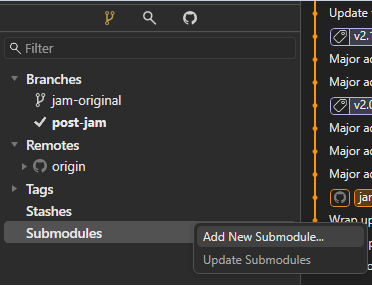
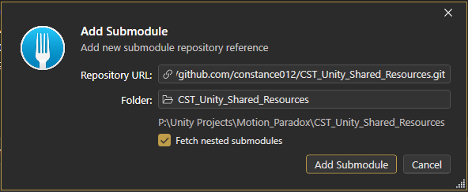
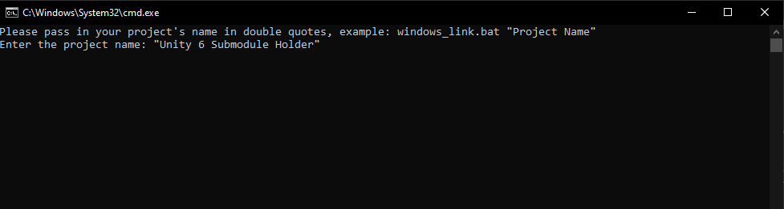
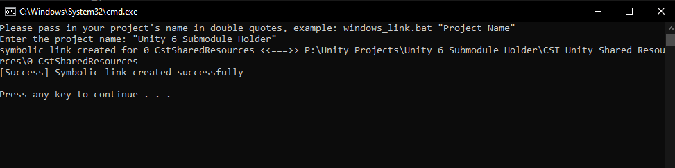

# CST_UNITY_SHARED_RESOURCES

## OVERVIEW

> __This repo is a submodule to be injected into other repositories, not meant to be used as a standalone Unity project.__

This repo includes all my shared _resources_, _scripts_, _plugins_, _packages_, and _libraries_ that I use across my __Unity 6__ projects.

## ADD THIS REPO AS A SUBMODULE

### 1. Using Fork

- Open your Unity project repository.
- On the left panel, right click __Submodules__ - __Add New Submodule__.

  

- Enter the __URL__ of this repo. Then specify the name of the folder __relative__ to your __current git repo__, but it is advised that you put this folder outside your Unity project's folder to avoid any unwated conflicts.

  

- Hit __Add Submodule__ to add this repo into your current repo as a submodule.

### 2. Using Command Line

- Cd into your git repo and use this command to add a new submodule.

`git submodule add [submodule-url] [relative-target-folder]`

- [submodule-url]: the __url__ of the submodule
- [relative-target-folder]: the target folder __relative__ to __your current repo__.

## CREATE LINK TO THE MAIN RESOURCES FOLDER

After adding this repo as a submodule, you need to __link__ the `main resources folder` to your Unity project's `Assets` folder.

### 1. For macOS

- Cd into your __Unity project's Assets__ folder.
- Run this command to __delete__ any existing, __corrupted__ folder with the same name as the main resources folder.

`rm -rf "0_CstSharedResources"`

- After that, create a __symbolic link__ points to the __main resource folder__ inside the submodule you just added.

`ln -s "[Your-Git-Folder-Path]\CST_Unity_Shared_Resources\0_CstSharedResources" "0_CstSharedResources"`

- And that's it, you've successfully injected the main resources folder into your Unity project. From now on, if the submodule __gets updated__ in the future, those changes will __also be reflected__ in your Unity project as well, if you fetch the latest of course.

### 2. For Windows

- Navigate into the __submodule__ folder: `[Your-Git-Folder-Path]\CST_Unity_Shared_Resources\`
- Locate and run the `windows_link.bash` file as __Administrator__. Then enter your Unity project's folder name into the CMD window, make sure to __wrap__ it in __double quotes__.

  

- Press __Enter__ and see if the symbolic link is __successfully created__, if not, double check your project's name.

  

## PACKAGES CREDITS

- [__Asset Usage Detector__](https://assetstore.unity.com/packages/tools/utilities/asset-usage-detector-112837) by [yasirkula](https://yasirkula.net/)
- [__Serialized Dictionary__](https://assetstore.unity.com/packages/tools/utilities/serialized-dictionary-243052) by [ayellowpaper](https://yellowpaperwastaken.wordpress.com/)
- [__DOTween (HOTween v2)__](https://assetstore.unity.com/packages/tools/animation/dotween-hotween-v2-27676) by [Demigiant](https://www.demigiant.com/)

_© 2022-2025 CST Games, all rights reserved._