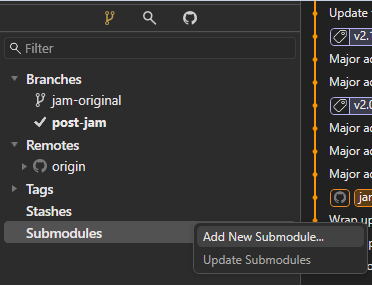
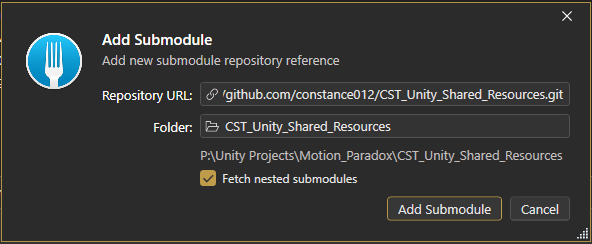

# CST_UNITY_SHARED_RESOURCES

## OVERVIEW

> __This repo is a submodule to be injected into other repositories, not meant to be used as a standalone Unity project.__

This repo includes all my shared _resources_, _scripts_, _plugins_, _packages_, and _libraries_ that I use across my Unity projects.

## ADD THIS REPO AS A SUBMODULE

### USING FORK

- Open your Unity project repository.
- On the left panel, right click __Submodules__ - __Add New Submodule__.

  

- Enter the __URL__ of this repo. Then specify the name of the folder __relative__ to your __current git repo__, but it is advised that you put this folder outside your Unity project's folder to avoid any unwated conflicts.

  

- Hit __Add Submodule__ to add this repo into your current repo as a submodule.

### USING COMMAND LINE

- Cd into your git repo and use this command to add a new submodule.

`git submodule add [submodule-url] [relative-target-folder]`

- [submodule-url]: the __url__ of the submodule
- [relative-target-folder]: the target folder __relative__ to __your current repo__.

## CREATE LINK TO THE MAIN RESOURCES FOLDER

After adding this repo as a submodule, you need to __link__ the `main resources folder` to your Unity project's `Assets` folder.
- Cd into your __git repo__ folder.
- Run this command to __delete__ any existing, __corrupted__ folder with the same name as the main resources folder.

`rd /S /Q [Your-Unity-Project-Path]\Assets\0_CstSharedResources`

- After that, create a __symbolic link__ points to the __main resource folder__ inside the submodule you just added.

`mklink /D [Your-Unity-Project-Path]\Assets\0_CstSharedResources [Your-Git-Folder-Path]\[Submodule-Relative-Folder]\Assets\0_CstSharedResources`

- And that's it, you've successfully injected the main resources folder into your Unity project. From now on, if the submodule __gets updated__ in the future, those changes will __also be reflected__ in your Unity project as well.

## PACKAGES CREDITS
- 